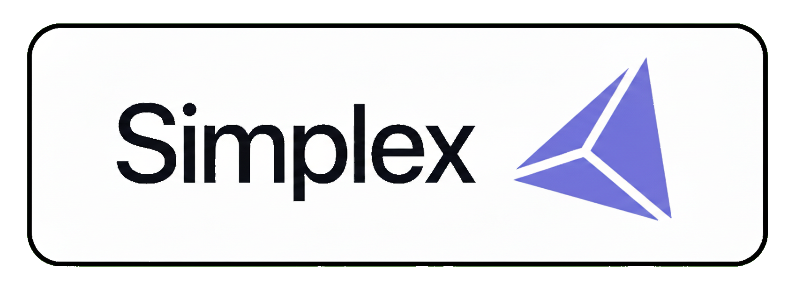

<p align="center">
  <a href="https://simplex.sh">
    
  </a>
</p>

<h1 align="center">Montage</h1>

<h3 align="center">Build agentic product videos with Next.js + Remotion</h3>

<p align="center">
  Programmatic motion graphics for product demos, feature walkthroughs, and launch videos — all written in React.
</p>

<p align="center">
  <a href="https://simplex.sh"></a>
  
  
  
</p>

<!-- TODO: Add a demo GIF here showing a rendered video
<p align="center">
  
</p>
-->

---

## What is Montage?

Montage is a toolkit for building polished product videos entirely in code. Instead of dragging clips around in a timeline editor, you compose scenes with React components, animate with spring physics, and render to MP4.

Built on [Remotion](https://remotion.dev) and [Next.js](https://nextjs.org), it includes a library of production-ready animations, background systems, and text effects — the same ones used in [Simplex](https://simplex.sh) product videos.

## Quick Start

```bash
# Clone the repo
git clone https://github.com/simplexlabs/montage.git
cd montage

# Install dependencies
npm install

# Open the visual editor
npx remotion studio
```

The Studio launches at `localhost:3000` with a live preview of every composition.

## Render a Video

```bash
# Render a specific composition to MP4
npx remotion render src/remotion/index.ts <CompositionId>

# Render a single frame as PNG
npx remotion still src/remotion/index.ts <CompositionId> --frame=60 --output=frame.png
```

## Project Structure

```
src/remotion/
├── shared/              # Reusable animations, text effects, backgrounds
│   ├── animations.ts    # Spring configs, easing, animation hooks
│   ├── FilmGrainOverlay # Film grain texture layer
│   └── AnimationReference.tsx
├── skills-install/      # Product install flow video
├── cli-deep-dive/       # CLI walkthrough video
├── QuestionFeatures/    # Feature showcase video
├── interactivity/       # Interactive demo video
└── Root.tsx             # All composition registrations
```

## Animation System

Every animation uses spring physics or eased interpolation — no linear motion, no CSS transitions. The `shared/animations.ts` module exports:

- **Spring presets** — `{ damping: 200 }` for smooth reveals, `{ damping: 20, stiffness: 200 }` for snappy motion
- **Text effects** — typing animations, word-by-word reveals, masked rises, drag-in entrances
- **Background layers** — radial vignettes, corner glows, film grain, scene palettes
- **Scene transitions** — power wipes, camera pans, focus shifts, staggered dissolves

See [`ANIMATION.md`](ANIMATION.md) for the full API reference.

## Compositions

<!-- TODO: Add rendered frame thumbnails for each composition -->

| Composition | Description | Duration |
|---|---|---|
| `SkillsInstallMaster` | Full product install walkthrough | ~30s |
| `SkillsInstall-Intro` | Intro sequence | 340 frames |
| `SkillsInstall-BrowserSection` | Browser login flow | 180 frames |
| `SkillsInstall-SDKSection` | SDK dashboard | 180 frames |
| `CLIDeepDiveMaster` | CLI feature walkthrough | ~30s |
| `AnimationReference` | All 25 animation primitives | 2250 frames |
| `AnimationDemo` | Text animation templates | 450 frames |
| `BackgroundExamples` | Background layer primitives | 450 frames |

## Deploy with Lambda

Montage supports serverless rendering via [Remotion Lambda](https://remotion.dev/lambda):

```bash
# Configure AWS credentials
cp .env.example .env
# Fill in REMOTION_AWS_ACCESS_KEY_ID and REMOTION_AWS_SECRET_ACCESS_KEY

# Deploy the Lambda function
node deploy.mjs
```

## Commands

| Command | Description |
|---|---|
| `npm run dev` | Start the Next.js dev server |
| `npx remotion studio` | Open the Remotion visual editor |
| `npx remotion render` | Render a composition to video |
| `npx remotion still` | Render a single frame to PNG |
| `npx remotion upgrade` | Upgrade Remotion to latest |

## Contributing

Contributions welcome. Please open an issue first to discuss what you'd like to change.

## Acknowledgments

Built on the [Remotion Next.js App Router + Tailwind template](https://github.com/remotion-dev/template-next-app-dir-tailwind) by the [Remotion](https://remotion.dev) team.

## License

Note that for some entities a Remotion company license is needed. [Read the terms here](https://github.com/remotion-dev/remotion/blob/main/LICENSE.md).

---

<p align="center">
  Built by <a href="https://simplex.sh">Simplex Labs</a>
</p>
